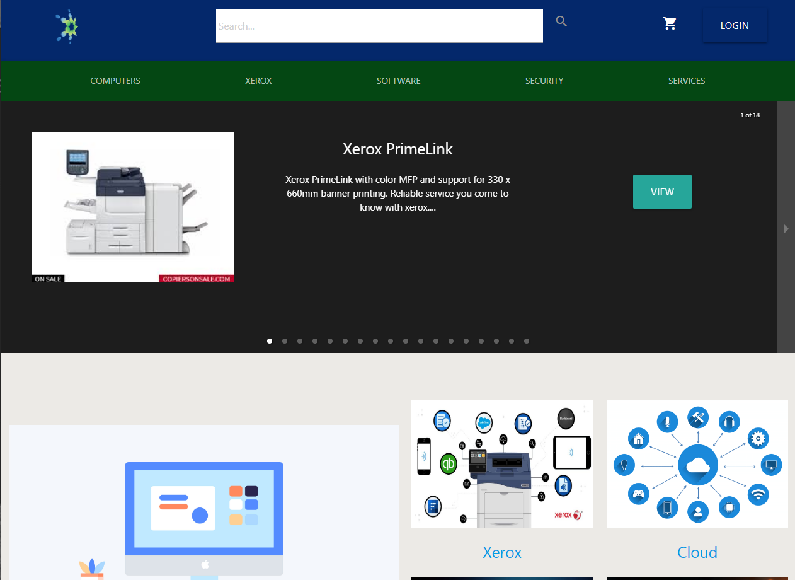

# Litzia Store Front

## Table of Contents

1. [Description](#description)
2. [Authors](#authors)
3. [Technologies](#technologies)
4. [Contributing](#contributing)
5. [Questions](#questions)

## Description

This was a application was for a Bellingham, WA company named Litzia. They were in need of a store front site and we provided a website that has the ability display their product with easy navigation for the customer to start with an empty cart to being able to checkout out and have a receipt emailed to them. We also have the added the ability on an admin account to add and update the website product and images.

## Deployed Application

- View the deployed application on [Heroku](https://l-z-mount-bjh.herokuapp.com/)

## Authors

|       Name       |          Email          |             Github              |                        LinkedIn                         |
| :--------------: | :---------------------: | :-----------------------------: | :-----------------------------------------------------: |
| Benjamin Hopkins |   bjhops17@gmail.com    |  (https://github.com/bh007183)  |   (https://www.linkedin.com/in/ben-hopkins-24a41357/)   |
|   Kevin Lyons    |    zinckev@gmail.com    | (https://github.com/lax-walrus) |  (https://www.linkedin.com/in/kevin-lyons-237a171b9/)   |
|   Kevin Hsieh    |   Khsieh95@gmail.com    |  (https://github.com/khsieh95)  |       (https://www.linkedin.com/in/kevinwjhsieh/)       |
|  Andrew Anthony  | a.anthony1835@gmail.com | (https://github.com/andrew1835) | (https://www.linkedin.com/in/andrew-anthony-a62357159/) |

 
 

## Technologies

- React.js
- javascript
- css
- Materialize
- bcrypt
- JWT
- MySQL
- Nodemailer

## Contributing

Please message us about pull request, or if you'd like to get involved with this project.

## Questions

Contact us with question with the information above

## License

MIT
